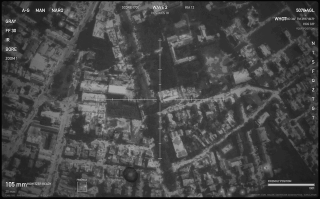

# AC-130 // DEFEND POSITION

A browser arcade game in the style of AC-130 gunship thermal footage. The twist: the
battlefield is **wherever you are**. The game reads your position, pulls real satellite
imagery of your surroundings, converts it to a white-hot IR picture, and sends waves of
hostiles closing in on your location. Hold them off with the 25 mm Gatling and the
105 mm howitzer.

**Play it now: [ac130.atbender.com](https://ac130.atbender.com)**

Single static `index.html`, no build step, no backend, no dependencies.



## Play

Hosted at **https://ac130.atbender.com**. To run it yourself, open `index.html` over HTTPS or localhost (browser geolocation needs a secure origin):

```sh
python3 -m http.server 8130 --bind 127.0.0.1
# then open http://localhost:8130/
```

Choose **Acquire my position (GPS)**, type a place, or use the demo position.
You can also deep-link: `index.html?lat=48.8584&lon=2.2945&name=PARIS`.

| Input | Action |
|---|---|
| Mouse | Slew the sensor (crosshair stays centred, like the real gimbal) |
| LMB | Fire selected weapon |
| `1` / `2`, RMB | 25 mm Gatling / 105 mm howitzer |
| `Z`, wheel | Sensor zoom |
| `B` | White-hot / black-hot |
| `P` `M` `R` | Pause, mute, restart |

## What's in it

- **Real terrain.** 225 satellite tiles around your position, fetched client-side from Esri
  World Imagery and pushed through a thermal tone pipeline (vegetation cold, concrete warm,
  soft-knee contrast, optic blur, bloom, grain, vignette). The view slowly rotates as the
  gunship orbits.
- **Hostiles with IR signatures.** Infantry squads with a walk cycle, technicals, troop trucks
  that dismount six soldiers, APCs, and tanks that only the 105 will stop. Pre-rendered at 4x
  and blurred so edges read like a real FLIR. Bodies and burning wrecks stay hot and cool over time.
- **Two weapons.** 25 mm with tracers, overheat and splash; 105 mm with a visible round arcing
  in, shot/splash calls, whiteout, dust cloud, screen shake and persistent craters.
- **Radio audio.** Everything is synthesized in Web Audio and routed through a band-limited,
  overdriven "headset" bus with squelch, so gunfire sounds like it comes over the intercom.
- **HUD** modelled on the footage: fixed crosshair with tick marks, sensor-mode column, AGL
  altitude, heading and north arrow, polarity, wave/score/base-integrity readouts, subtitles.

## Privacy

Your position never leaves your browser and is never displayed. The HUD's grid reference
is random decoy text. Tile requests go directly from your browser to Esri; the page's
host only serves this one file. Note that the imagery itself is of your surroundings,
so a screenshot shows where you are to anyone who recognises the area.

## Testing

`test/cdp-harness.mjs` drives the game in headless Chrome over the DevTools protocol
(Node 22+, no puppeteer): measures fps, spawns each vehicle type, fires both weapons,
and saves screenshots and game state. Start the local server first, then:

```sh
node test/cdp-harness.mjs /tmp/ac130-test
```

## Credits

Imagery: Esri, Maxar, Earthstar Geographics. Geocoding for place search: OpenStreetMap
Nominatim. This is a simulation for entertainment.
